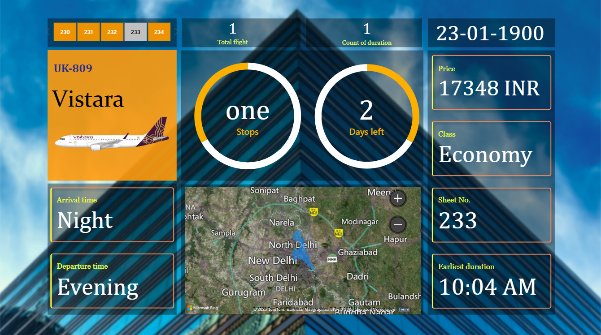

# Airlines-Dashboard
This Power BI dashboard provides a detailed, interactive view of flight details for Vistara Flight UK-809. It is designed to help travelers and airline staff quickly analyze schedules, pricing, and travel information in a visually engaging format.

# ✈️ Flight Information Dashboard – Vistara UK-809

This Power BI dashboard provides a detailed, interactive view of flight details for **Vistara Flight UK-809**.
It is designed to help travelers and airline staff quickly analyze schedules, pricing, and travel information in a visually engaging format.

## 🔹 Key Features
- **Flight Overview:** Displays flight number, airline name, and aircraft image.
- **Ticket & Travel Details:**
  - Price: `₹17,348`
  - Class: `Economy`
  - Seat Number: `233`
- **Travel Schedule:**
  - Departure Time: **Evening**
  - Arrival Time: **Night**
  - Earliest Duration: **10:04 AM**
- **Trip Insights:**
  - Stops: **One**
  - Days Left: **2**
- **Interactive Map:** Shows the geographical route with a map centered on **New Delhi**.
- **Summary Cards:**
  - Total Flights: `1`
  - Duration Count: `1`

## 🛠 Tools & Technologies Used
- **Power BI** for interactive visualization
- **Microsoft Bing Maps** integration for route mapping
- **Custom formatting & design** for an airline-themed interface

## 📷 Dashboard Screenshot

---
*Created using Power BI with a focus on clear, real-time flight insights.*
